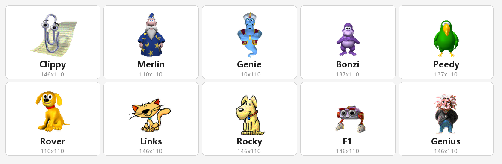
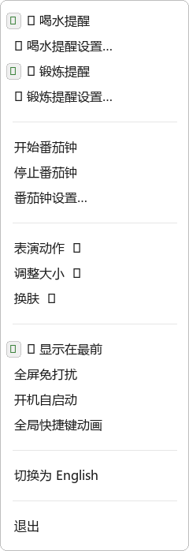

# Clippy 桌面宠物

基于 **Office 2003 和 Microsoft Bob 中官方素材**的桌面宠物：喝水/锻炼提醒、番茄钟、全局快捷键动画、10 款官方角色换肤。所有动画逐帧还原原版，动作自然衔接。

> [English](README.en.md) | 简体中文

## 🤖 开发说明

本项目使用 **DeepSeekV4-Flash-0731** vibe coding。

## ✨ 功能

### 🐱 换肤（10 款官方角色）



- 素材来自 [clippyjs/clippy.js](https://github.com/clippyjs/clippy.js) 官方 `agents/` 目录，共 10 个角色：**Clippy**（经典回形针）、Merlin（巫师）、Genie（神灯）、Bonzi（猩猩）、Peedy（鹦鹉）、Rover（小狗）、Links（猫咪）、Rocky（摇滚）、F1（车手）、Genius（天才）
- 右键菜单「换肤」：每个皮肤带**缩略图预览**，勾选当前皮肤
- **换肤过渡动画**：旧皮肤播放「再见」→ 新皮肤播放「打招呼」→ 自然回待机
- **皮肤专属表演动作菜单**：只显示该皮肤有真实动画的动作（如 Rover 动作集最小，菜单自动精简）
- 各皮肤动画名差异大，语义映射自动回退（如 Rover 无 `Save` 用 `Money`），保证所有皮肤都能表演

### 💧 提醒
- **喝水提醒**：默认 45 分钟（可在设置中改间隔），`Alert` 动画 + 原版黄色气泡 + 响铃
- **锻炼提醒**：默认 60 分钟，`GetAttention` 动画 + 气泡
- 右键菜单可**开关**、**设置间隔**（Clippy 风格气泡对话框）、暂停 10 分钟
- 全屏免打扰期间静默跳过、顺延到下一周期

### 🍅 番茄钟
- 默认 25 分钟工作 + 5 分钟休息（可设置 1~180 分钟）
- 工作播 `Thinking`、最后 1 分钟播 `Writing`、完成播 `Congratulate`、休息播 `IdleSnooze`——每个动画**播一次自然回待机**（不再无限循环）

### ⌨ 全局快捷键动画
- 按下快捷键时宠物播放对应动画（**只观察不拦截**，其他程序照常收到按键）：
  | 快捷键 | 动作 |
  |---|---|
  | Ctrl+S | 保存 |
  | Ctrl+P | 打印 |
  | Ctrl+F | 查找 |
  | Ctrl+Shift+M | 发邮件 |
  | Ctrl+Delete | 删除 |
  | Ctrl+Shift+P | 处理中 |
- 右键「⌨全局快捷键动画」开关（默认关闭）；动画有超时保险，不会无限播放

### 🖥 显示控制
- **显示在最前**（置顶，默认开）
- **全屏免打扰**：检测到真全屏应用（视频/游戏/演示）时自动隐藏宠物并静默提醒，退出全屏自动恢复；**优先级高于置顶**——全屏时即使置顶也隐藏（含 Chrome F11 全屏）
- **开机自启动**（HKCU 注册表，用户级免管理员）
- **调整大小**：100% ~ 400%

### 🌐 其他
- **中英文菜单切换**
- 左键拖动 / 双击惊讶 / 悬停挥手
- **退出效果**：播放当前皮肤的「再见」动画后退出
- **设置持久化**：所有设置自动保存到 `settings.json`，重启保持
- 待机动画自然化：每个待机动作展示 2.5~4.5 秒，经收尾帧优雅切换

## 🚀 运行

### 方式一：直接运行 exe（推荐）
打包产物在 `dist/ClippyPet-v0.2.1/`，双击 `ClippyPet-v0.2.1.exe` 即可，**无需安装 Python**；整目录拷到其他电脑也能用。

### 方式二：源码运行
```bash
pip install pillow pyinstaller
python clippy_pet.py
```
或双击 `run_clippy-pet.bat`（无控制台窗口，经计划任务启动避免被终端清理）。

## 📖 使用

右键点击宠物弹出菜单，菜单结构如下：



喝水/锻炼提醒（开关 + 设置）、番茄钟（开始/停止/设置）、表演动作（按皮肤过滤）、换肤、打招呼、关于、显示在最前、全屏免打扰、开机自启、全局快捷键动画、语言切换、退出。

## 🛠 打包成 exe

```bash
python -m PyInstaller --noconfirm --clean ClippyPet-v0.2.1.spec
```
- 产物：`dist/ClippyPet-v0.2.1/ClippyPet-v0.2.1.exe`（onedir，含全部皮肤素材）
- 生成图标：`python make_icon.py`（从 Clippy 第一帧生成 `clippy.ico`）
- 打包后 `settings.json` 自动持久化到 exe 所在目录

## 📁 项目结构

```
clippy-pet/
├── clippy_pet.py            # 主程序（动画引擎 + 提醒 + 番茄钟 + 快捷键 + 菜单）
├── assets/
│   ├── skins/<皮肤>/        # 10 款皮肤：frames/*.png 精灵帧 + animations.json
│   └── dl/skins/<皮肤>/     # 原始官方素材（agent.js + map.png）
├── extract_skins.py         # 皮肤素材提取脚本（从原始素材重建 skins/）
├── ClippyPet-v0.2.1.spec   # PyInstaller 打包配置
├── make_icon.py             # exe 图标生成脚本
├── launch.py                # 后台启动器（计划任务方式，避免被终端清理）
├── run_clippy-pet.bat        # 无控制台启动脚本（经计划任务）
├── settings.json            # 用户设置（自动生成）
└── 测试脚本: smoke_test.py（冒烟）、hotkey_test.py、pomo_anim_test.py、
    skin_switch_test.py、skin_menu_test.py、dnd_pin_test.py、dnd_zorder_test.py、
    chrome_f11_test.py、idle_anim_test.py、reminder_settings_test.py、
    quit_test.py、frozen_test.py（打包路径验证）
```

## ⚙️ 配置

所有设置通过菜单修改后自动保存到 `settings.json`（语言、皮肤、缩放、置顶、免打扰、自启、快捷键开关、提醒间隔、番茄钟时长等）。也可直接编辑该文件（需先退出程序）。

## 📦 素材来源

- 仓库：[clippyjs/clippy.js](https://github.com/clippyjs/clippy.js)（MIT License）
- 素材路径：`agents/<角色>/agent.js`（动画定义）+ `map.png`（精灵表）
